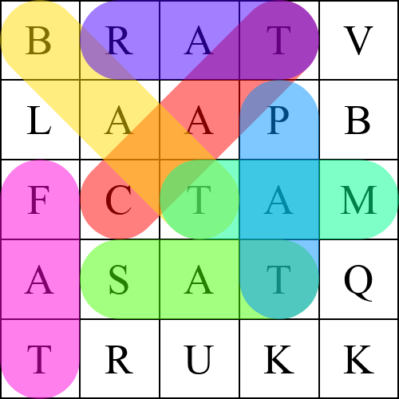

# crossword_puzzle_generator_JS :jigsaw:
A tool for generating crossword puzzles instamagically.

## About
Generates a specific size square crossword with the given words.

The algorithm makes sure that each word given is used once in the crossword.

If the crossword with the given constraints is not able to be created, it will stop the program and alert the user.

## Features
Answer key for the crossword with colored, highlighted letters generated as well.

Crossword has a chance of containing diagonal or overlapping words.

Prevents the user from making palindrome words to avoid player confusion.

## Algorithm
Uses the Monte Carlo method and encourages overlap of words by natural selection.

Has a limited number of iterations before the current configuration is given up and a new one is attempted.

Every time the algorithm decides to place a word into the crossword, it cannot move it unless the algorithm is reinstantiated.
